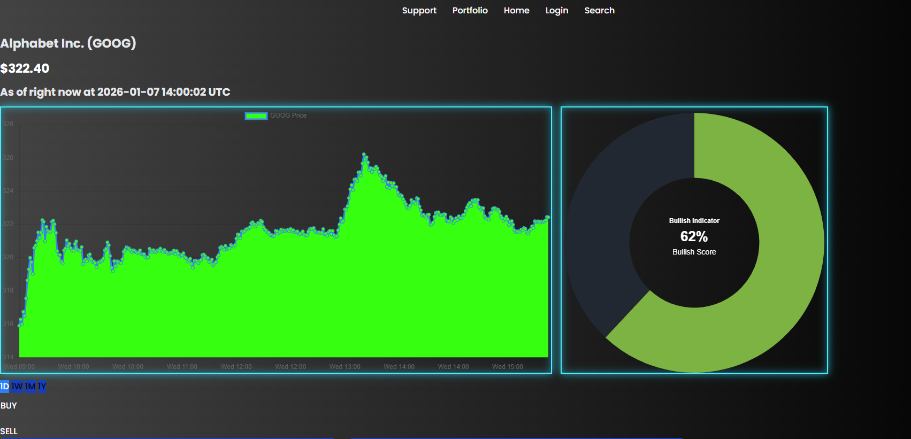
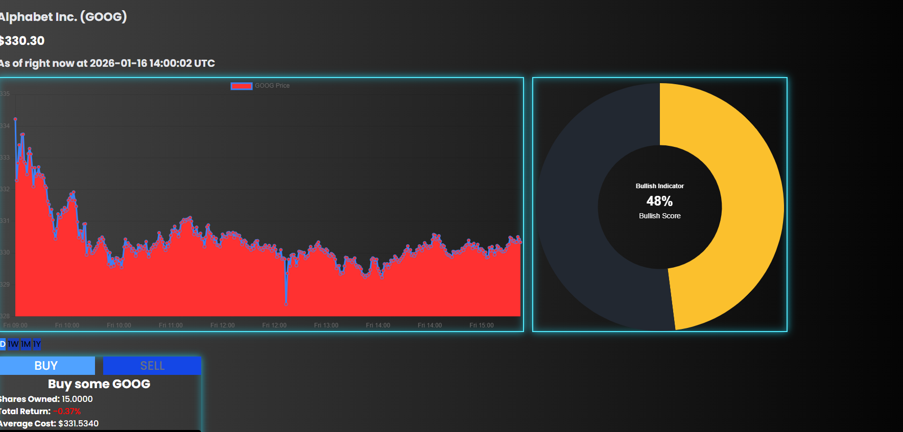
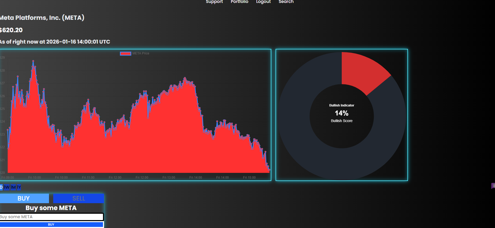
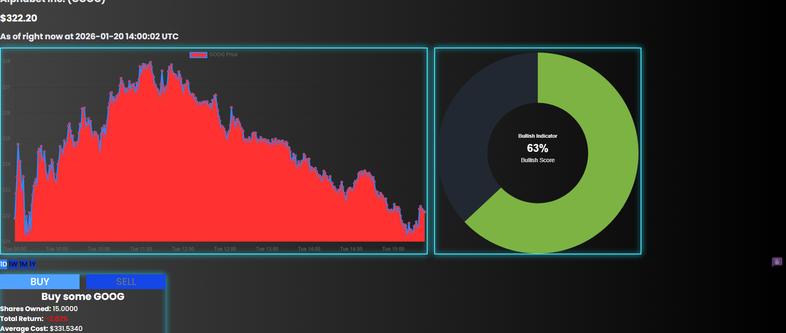
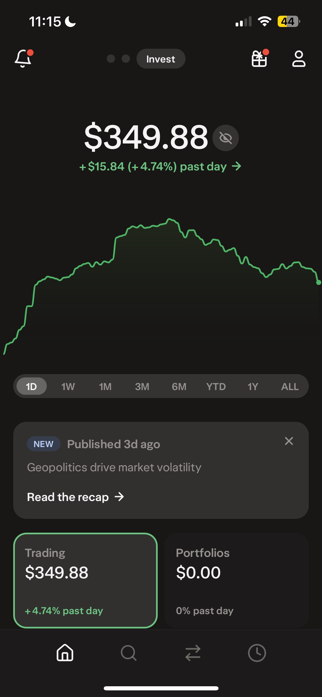
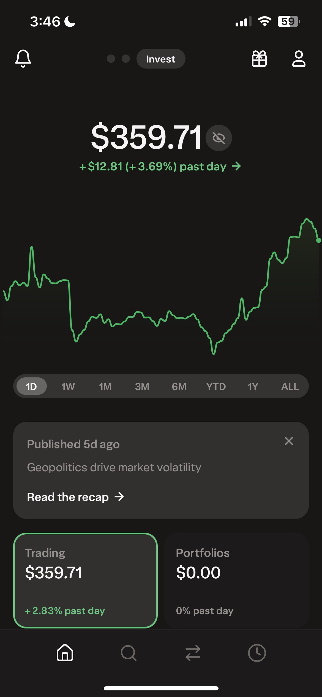

# Project Title: MARKETSIGHT

MarketSight is a Python-powered analytics platform that backtests trading strategies, visualizes performance, and integrates with real financial APIs like Yahoo query and Alpaca. This will be a way for users to actively create strategy with AI assisting them in their future endeavors. To me, Information is power, especially in investment. Powered by Anthropic AI, we're planning to help Retail investors to make wise decisions on their investment in order to retire early. To me, everyone deserves to have the sense of victory when they see their stock grow so rapidly. I had that experience with Bitcoin, PNG.V (Kraken Robotics), etc. I used AI tools to dumb down the informations for me and how the news and macroeconomics could impact my stock. 

# Backend: 
* We've used Django for this project, as I personally started this project initially just to learn Django, and I've gotten interested about API, and I figured that it's easy to use url routing in order to connect my views.py towards JS and visualize information seamlessly, and I found it pretty decent. Django also has a built in caching tool, which I used to potentially handle millions of user and used cache timeoue for performance optimization, and we're likely to see much  more accurate data, which I wish to provide as investing is a high-risk high-reward endeavour, and I sincerely believe that information can empower investors over reckless decisions. 

# Data Used:
* For Marketsight, we've used YahooQuery and Alpaca for my financial data.

# Tradeback:
* Our Django-powered analyitics is not meant for day-trading, as it's meant usually for mid-term, or long-term investment due to its slow response time (which relies entirely on how many users will be using my product, as I've used a caching as my state management for the crucial part of my code that requires multiple API requests). Day-trading support would require me to implement web sockets
## Demo:

## Experiment (Testing out via Leveraged ETF): (JANUARY 7TH 2026 - Feburary 7th 2026) (Buying Short Position for short-term on META BEAR , and VIX long)

# TESTING GLOBAL CRISIS INDICATOR (I AM HOLDING SHORT TERM SHORT POSITIONS)

# SOLD: VIX 2x LONG at 6.35% return

