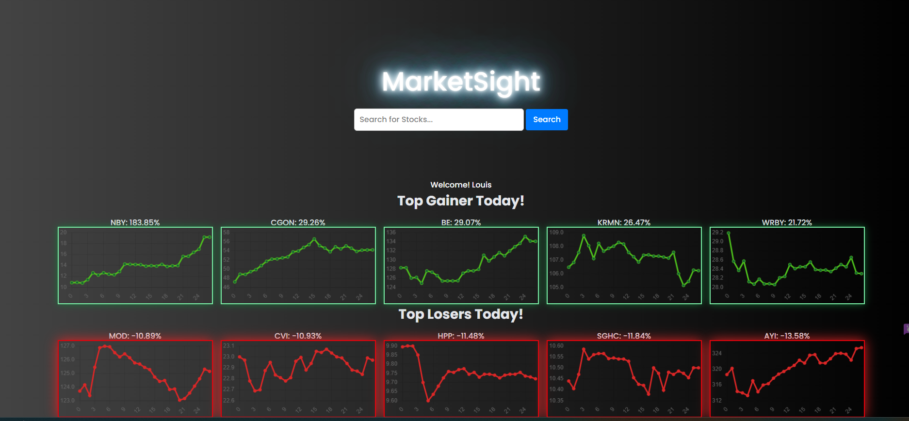
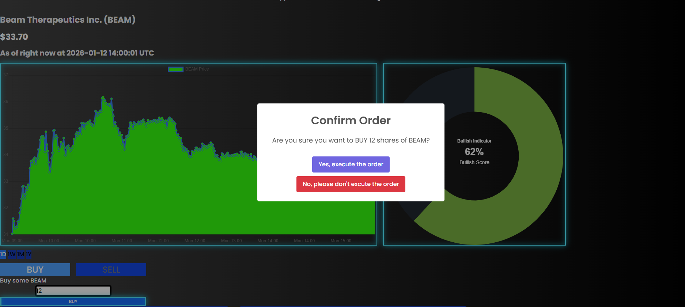
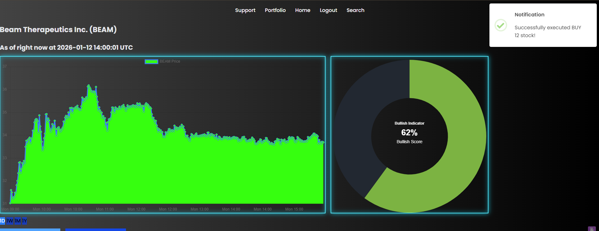
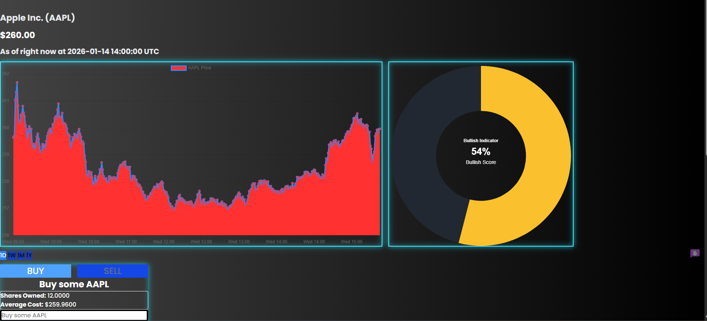
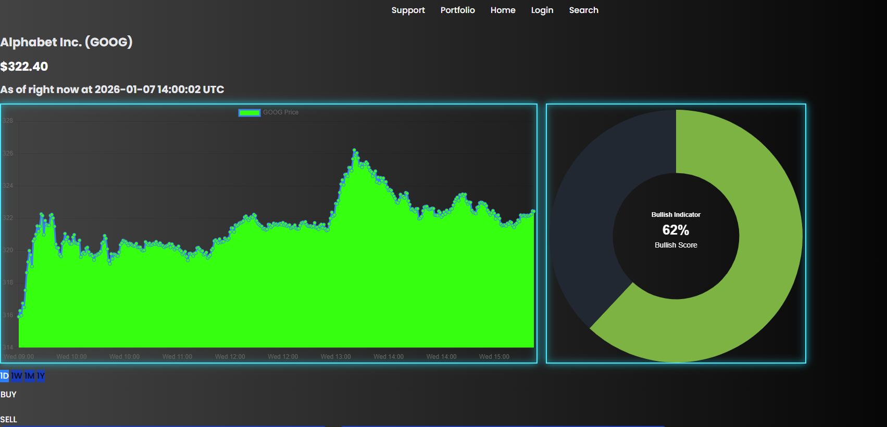
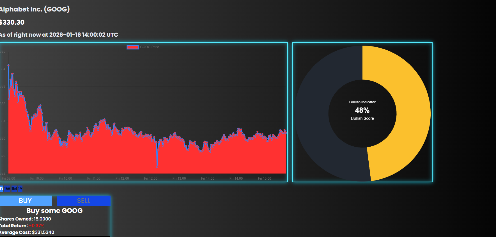
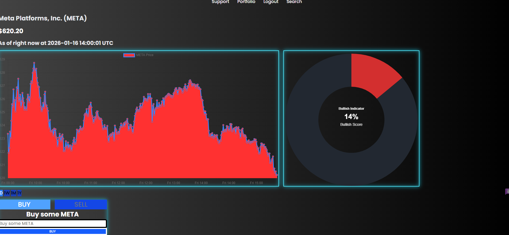

# Project Title: MARKETSIGHT

MarketSight is a Python-powered analytics platform that backtests trading strategies, visualizes performance, and integrates with real financial APIs like Yahoo query and Alpaca. This will be a way for users to actively create strategy with AI assisting them in their future endeavors. To me, Information is power, especially in investment. Powered by Anthropic AI, we're planning to help Retail investors to make wise decisions on their investment in order to retire early. To me, everyone deserves to have the sense of victory when they see their stock grow so rapidly. I had that experience with Bitcoin, PNG.V (Kraken Robotics), etc. I used AI tools to dumb down the informations for me and how the news and macroeconomics could impact my stock. 

# PLANS:
We've made the Anthropic API work to its perfection and created many features to support User experience. But the job is not finished yet

## Demo:

## Experiment (Testing out via Leveraged ETF): (JANUARY 7TH 2026 - Feburary 7th 2026) (Buying Short Position for short-term on META BEAR , and VIX long)

# TESTING GLOBAL CRISIS INDICATOR (I AM HOLDING SHORT TERM SHORT POSITIONS)

# SOLD: VIX 2x LONG at 6.35% return
